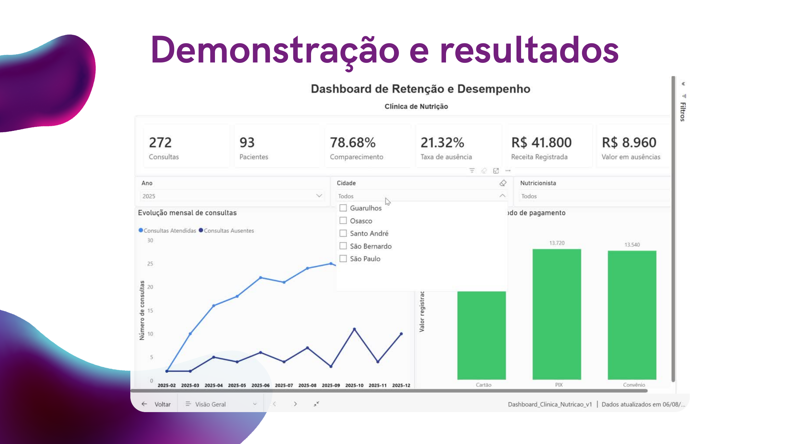

# Data-Driven Nutrition — Retenção e Performance em Clínicas de Nutrição

Projeto de análise de dados desenvolvido para transformar registros de pacientes, consultas e pagamentos em **indicadores de retenção, absenteísmo e priorização de acompanhamento** para uma clínica de nutrição.

> **Dados simulados** | Python · Pandas · SQL · SQLite · Power BI · DAX



## Problema de negócio

Clínicas podem possuir muitos dados operacionais sem utilizá-los de forma estruturada para responder perguntas importantes, como:

- Quantos pacientes retornam após a primeira consulta?
- Quais grupos apresentam menor retenção?
- Onde se concentram as ausências?
- Quais pacientes precisam de acompanhamento prioritário?

O objetivo deste projeto foi construir uma análise capaz de transformar essas perguntas em **métricas, insights e recomendações acionáveis**.

## Solução desenvolvida

O fluxo analítico foi estruturado em cinco etapas:

1. **Validação e tratamento dos dados** com Python e Pandas.
2. **Modelagem relacional e consultas SQL** em SQLite.
3. **Análise de retenção** em 30, 60 e 90 dias.
4. **Score exploratório de risco de abandono**, baseado em critérios transparentes.
5. **Dashboard interativo no Power BI**, com métricas e medidas DAX para acompanhamento gerencial.

## Principais resultados

| Indicador | Resultado |
|---|---:|
| Pacientes cadastrados | 100 |
| Consultas agendadas | 386 |
| Comparecimentos | 307 |
| Ausências | 79 |
| Taxa de comparecimento | **79,53%** |
| Taxa de ausência | **20,47%** |
| Receita total registrada | **R$ 58.040** |
| Valor registrado em consultas ausentes | **R$ 11.940** |
| Retenção em 30 dias | **25,64%** |
| Retenção em 60 dias | **75,64%** |
| Retenção em 90 dias | **82,05%** |
| Tempo médio até o primeiro retorno | **46,86 dias** |
| Pacientes com risco alto ou médio | **15** |

> O valor associado às consultas ausentes **não foi tratado como perda de receita**, pois a base simulada não contém informação sobre cobrança, reembolso ou cancelamento.

## Insights encontrados

- Apenas **25,64%** dos pacientes retornaram em até 30 dias; a maior concentração do primeiro retorno ocorreu entre **31 e 60 dias**.
- Pacientes com **60 anos ou mais** apresentaram retenção de **60,00% em 60 dias**, abaixo dos demais grupos etários.
- O acompanhamento **Bariátrica** apresentou retenção de **64,29% em 60 dias**.
- **Guarulhos (61,54%)** e **São Bernardo (60,00%)** apresentaram as menores retenções geográficas em 60 dias.
- O score exploratório identificou **1 paciente de alto risco e 14 de risco médio**, criando uma lista operacional de priorização.

## Recomendações de negócio

### 1. Antecipar o primeiro retorno
Como somente 25,64% retornaram nos primeiros 30 dias, uma oportunidade é incentivar o agendamento da próxima consulta ainda no primeiro atendimento, dentro de uma janela clínica previamente definida.

### 2. Criar uma rotina de acompanhamento de risco
Os **15 pacientes classificados como risco alto ou médio** podem formar uma lista prioritária para lembretes, contato e tentativas de reagendamento, registrando o resultado das ações.

### 3. Desenvolver ações segmentadas
Pacientes com 60 anos ou mais, acompanhamento bariátrico e residentes de Guarulhos e São Bernardo apresentaram menor retenção. Esses grupos podem ser investigados para entender barreiras de horário, deslocamento, modalidade de atendimento ou necessidade de suporte adicional.

### 4. Reduzir ausências
Com uma taxa de ausência de **20,47%**, recomenda-se avaliar confirmação automática, lembretes antecipados e uma política clara de cancelamento e reagendamento. Registrar os motivos das faltas permitiria análises futuras mais precisas.

### 5. Monitorar os indicadores continuamente
O dashboard pode apoiar o acompanhamento periódico de comparecimento, ausência, retenção, intervalo entre consultas, pacientes sem retorno e nível de risco.

## Tecnologias

- **Python** — tratamento, validação e análise exploratória
- **Pandas / NumPy** — manipulação e cálculo de métricas
- **SQL / SQLite** — joins, agregações, validações e análise de retenção
- **Matplotlib** — visualizações exploratórias
- **Power BI** — modelagem, dashboard e filtros interativos
- **DAX** — KPIs e medidas de negócio

## Estrutura do repositório

```text
nutrition-clinic-retention-analysis/
├── README.md
├── nutrition_clinic_retention_analysis.ipynb
├── requirements.txt
├── .gitignore
├── assets/
│   └── dashboard-preview.png
├── data/
│   └── README.md
├── demo/
│   └── dashboard_powerbi_demo.mp4
├── docs/
│   └── data_driven_nutrition_presentation.pdf
├── powerbi/
│   └── README.md
└── sql/
    └── analysis_queries.sql
```

## Como executar

1. Clone o repositório.
2. Adicione os quatro arquivos simulados na pasta `data/` com os nomes indicados em `data/README.md`.
3. Instale as dependências:

```bash
pip install -r requirements.txt
```

4. Abra e execute `nutrition_clinic_retention_analysis.ipynb`.

## Materiais do projeto

- **Notebook completo:** `nutrition_clinic_retention_analysis.ipynb`
- **Consultas SQL:** `sql/analysis_queries.sql`
- **Apresentação executiva:** `docs/data_driven_nutrition_presentation.pdf`
- **Demonstração do dashboard:** `demo/dashboard_powerbi_demo.mp4`

## Limitações

Os dados são simulados e os resultados demonstram a aplicação da metodologia analítica, não o desempenho de uma clínica real. O score de risco é heurístico e não corresponde a um modelo preditivo validado. Algumas segmentações possuem grupos pequenos e devem ser interpretadas de forma exploratória, sem inferência causal.

---

**Objetivo do projeto:** demonstrar uma abordagem end-to-end de análise de dados, conectando preparação de dados, SQL, métricas de negócio, análise de retenção e visualização em Power BI com **recomendações para tomada de decisão**.
